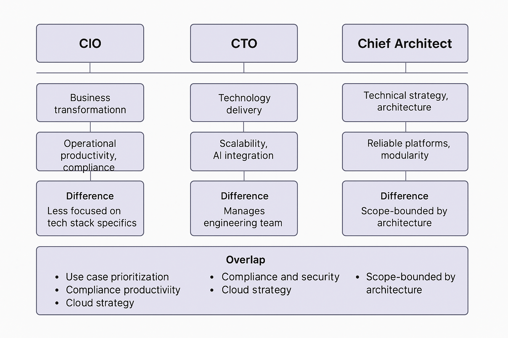

# FX-Risk-AI-Platform

## Purpose of this Repo
The umbrella meta-repo containing high-level documentation, architecture diagrams (TOGAF, BDAT, Zachman), and links to all the above component repos.

## Introduction

The **Fx-Risk-AI-Platform** is an enterprise-grade, modular AI architecture designed to transform operational efficiency, exception handling, and compliance workflows across Forex (FX) desk operations. It leverages generative AI, machine learning, orchestration APIs, and intelligent automation to deliver real-time, desk-aligned insights and actions.

> This meta-repo links all sub-repos: UI, orchestration, AI services, forecasting pipelines, infrastructure, and more.

---

## Strategic Objectives

- **Reduce Operational Friction:** Automate FX exception classification, ticket routing, and chat summarization across desks and shifts.
- **Enable Real-Time Desk Forecasting:** Predict NOP volumes and SLA risks for day-end planning and resourcing.
- **Streamline Trade Confirmations & Routing:** Intelligent confirmation handoffs to the right desk, region, or counterparty.
- **Democratize AI Without Deep ML:** Leverage zero-shot and prompt-based AI tools to unlock value without complex model training.
- **Strengthen Audit & Compliance:** Flag trade amendments, late breaks, and inconsistencies with hybrid rule-based + LLM logic.

---

## Chief Architect Perspective

> _"The job is not to deploy AI, but to **elevate operational clarity** across time zones, currencies, and exception categories."_  
> — Chief Architect

### Strategic Mindset

- **Business-Driven Design:** Architecture must **map directly to business outcomes** — NOP forecasting, exception speed, desk-level clarity — not abstract tech outputs.
- **"It Works" vs. "It Transforms":** Deliver **step-change operational value**, not just minimal integrations. Think in terms of FX desk enablement, not API coverage.
- **Cloud-Native First:** Default to **AWS-native primitives** (Bedrock, SageMaker, Glue, Lambda) to maximize scalability, observability, and integration velocity.
- **AI as a Co-Pilot, Not a Toy:** Integrate generative AI where it reduces ambiguity, resolves decisions, or eliminates queue fatigue — not just for demo appeal.
- **Platform Thinking, Not Point Projects:** The platform is a **fabric of intelligent services**, not a set of siloed bots or dashboards.

### Architecture Strategy

- **Modular Microservices:** Each repo follows domain-driven design — from LLM insights to forecasting pipelines and orchestration layers.
- **Composable Infrastructure:** Built with AWS-native primitives (S3, Lambda, SageMaker, Bedrock, Glue) using IaC principles.
- **Validation-First Mindset:** Each AI outcome is testable, traceable, and auditable across environments.
- **Prompt Reuse & Standardization:** Shared prompt libraries ensure consistency and reduce redundancy in AI logic.
- **Pluggable AI Agents:** Each Bedrock/LLM component is deployable independently and callable from orchestration APIs.

---

## CIO-Level Value Proposition

> _"We don’t just automate workflows — we create real-time, insight-rich FX operations that scale."_  
> — CIO

### Strategic Impact Areas

| Value Area                | Business Impact |
|---------------------------|-----------------|
| **Operational Predictability** | Desk-level visibility into NOP volume surges, SLA breach risks, and margin reconciliation complexity. |
| **AI-Augmented Ops**         | LLM-based exception classifiers, summarizers, and next-best-action models reduce manual load across desks. |
| **Cross-Team Coordination**  | Unified orchestration logic across Ops, Treasury, and Legal teams improves coverage and compliance. |
| **Built-in Audit & Governance** | Automated detection of late trades, duplicate disputes, and unresolved escalations — logged with context. |
| **Cloud-Native Scalability** | Built on Bedrock, SageMaker, Lambda, and QuickSight for high-performance, serverless, scalable ops. |
| **Faster Time to Value**     | Zero-shot and prompt-based AI use cases reduce development cycles from months to weeks. |

### CIO KPIs to Track

- Reduction in FX break resolution time
- SLA compliance rate across time zones
- Escalation handoff consistency and summary quality
- LLM action suggestion accuracy and desk feedback
- NOP forecast accuracy (vs actual desk volumes)
- Audit flag resolution rates

---

## Component Repositories

Refer to the [Tooling Strategy ](#️-tooling-strategy) for a full list of linked repositories and the frameworks used in each.

---

## Tooling Strategy 

This section outlines the chosen frameworks and tools for each repository in the `fx-risk-ai` platform, based on architecture fit, scalability, and domain needs.

| Repository Name                   | Framework / Tool     | Justification |
|----------------------------------|----------------------|---------------|
| **fx-risk-ai-portal**            | Angular              | Enterprise-grade UI framework with modular architecture and built-in routing; ideal for desk-level dashboards and ops workflows. |
| **fx-risk-ai-orchestration-api** | Django + Django REST Framework (DRF) | Excellent for structured APIs, backend workflows, admin interface, and ORM-based trade/exception models. |
| **fx-risk-ai-insights-engine**   | FastAPI              | Lightweight and high-performance framework for AI/LLM microservices (e.g., summarization, classification, embeddings). |
| **fx-risk-ai-forecasting-pipeline** | PySpark / AWS Glue | Suited for large-scale ETL and batch forecasting jobs (e.g., NOP prediction); integrates well with Amazon Forecast and S3. |
| **fx-risk-ai-validation-suite**  | Django + Pytest      | Ideal for test harnessing, integration test orchestration, and result visualization if needed. |
| **fx-risk-ai-ops-scripts**       | Django Management Commands | Cleanly integrates with Django projects; supports administrative tasks like loaders, migrations, and CLI-based scripts. |
| **fx-risk-ai-shared-libs**       | Python Package (Framework-Agnostic) | Prompts, embedding utilities, constants, and shared routing rules usable across all services without tight coupling. |
| **fx-risk-ai-infra**             | AWS CDK or Terraform | Infrastructure-as-code for provisioning AWS services (e.g., Bedrock, SageMaker, Glue, S3, IAM, QuickSight). |
| **fx-risk-ai-platform**          | Markdown + Diagrams + Docs | Meta-repo for linking components, managing strategy artifacts, BDAT/Zachman diagrams, and system-wide documentation. |

## Strategic Prioritization for CIO, CTO, and Chief Architect

The Fx-Risk-AI platform is not just a technical implementation — it's an enterprise transformation accelerator for FX desk operations. The following prioritization matrix offers a role-specific lens on what to drive first, why, and how it adds value.

---

### CIO, CTO, and Chief Architect Role Alignment

---

### Chief Architect Priorities

| Focus Area | Why It Matters | What to Drive First |
|------------|----------------|----------------------|
| **Domain-Driven Architecture** | Align tech boundaries with FX ops domains (exceptions, audit, routing, forecasting) | Set up modular repos, APIs, and shared libraries |
| **Composable AI Services** | Isolate prompt-based logic and ML inference from orchestration | Bedrock/SageMaker service scaffolding in `fx-risk-ai-insights-engine` |
| **Prompt Engineering & Reuse** | Maintain consistency across summarizers, classifiers, responders | Design prompt templates in `fx-risk-ai-shared-libs` |
| **Validation First** | Ensure every AI output is testable and traceable | Build eval harness in `fx-risk-ai-validation-suite` |
| **Infra-Driven Thinking** | Code is deployed, not just developed | Start with `fx-risk-ai-infra` and IaC pipelines |

---

### CIO Priorities

| Focus Area | Why It Matters | What to Drive First |
|------------|----------------|----------------------|
| **Business-Value Mapping** | All AI must tie to operational ROI | Establish metrics: SLA adherence, break resolution time, handoff quality |
| **Scalable Forecasting** | Volume spikes = resourcing gaps | Launch `fx-risk-ai-forecasting-pipeline` with QuickSight visibility |
| **Ops Enablement (Not Just Automation)** | Empower analysts, don't replace them | Deploy exception categorizer + chat summarizer early |
| **Governance & Auditability** | AI output must meet regulatory standards | Build audit and rule-based alert system in `fx-risk-ai-orchestration-api` |
| **Cross-Function Alignment** | Treasury, Legal, Ops all benefit — unify flows | Ensure orchestration logic supports multi-team routing and escalation flows |

---

### CTO Priorities

| Focus Area | Why It Matters | What to Drive First |
|------------|----------------|----------------------|
| **Cloud-Native by Default** | Avoid lock-in, maximize managed services | Bedrock, SageMaker, Glue, and CDK-first infra rollout |
| **Secure & Compliant Design** | Protect data across regions and desks | IAM, encryption, role boundaries via `fx-risk-ai-infra` |
| **DevOps + Observability** | Deployment confidence + issue traceability | GitHub Actions + CloudWatch + OpenSearch integration |
| **CI/CD & Multi-Env Workflows** | Dev/Staging/Prod parity needed for AI testing | Pipelines for each repo with environment context |
| **Cost Visibility** | LLMs and compute need ROI tracking | Track Bedrock/SageMaker invocation volume per use case |

---

Each role contributes a layer of decision-making:  
- **Chief Architect** ensures systems are well-shaped  
- **CTO** ensures they run reliably and securely  
- **CIO** ensures they drive business transformation

Use this lens to phase implementation in a way that maximizes impact early and scales responsibly.

---

## CIO vs. Chief Architect — Roles in Fx-Risk-AI Platform

### Role Comparison Table

| Theme / Area              | CIO Role                                                                 | Chief Architect Role                                                            | Overlap? |
|---------------------------|--------------------------------------------------------------------------|----------------------------------------------------------------------------------|----------|
| Vision & Strategy         | Define enterprise-wide goals: faster FX operations, audit alignment, LLM-assisted productivity | Translate strategy into BDAT-aligned design, modular repos, and AWS service orchestration | Yes      |
| Use Case Prioritization   | Focus on value streams: SLA risk reduction, faster dispute resolution, fewer escalations | Focus on AI and workflow fit: what's feasible now vs. later, reusability         | Yes      |
| Architecture Governance   | Demand adherence to security, compliance, and cost transparency          | Ensure implementation conforms to standards, boundaries, and documentation       | Yes      |
| Technology Selection      | Approve or oversee cloud strategy and enterprise architecture alignment  | Choose appropriate AWS services, AI tools, and frameworks per domain             | Yes      |
| Forecasting and Analytics | Want visibility into desk-level volumes and planning signals             | Design data pipelines and QuickSight dashboards to deliver them                  | Yes      |
| Audit and Compliance      | Ensure AI actions are explainable, auditable, and regulator-friendly     | Build traceable LLM and rule hybrids, and log every action path                  | Yes      |
| Delivery Cadence / MVP Focus | Drive toward operational PoC: “What will reduce pain in 60–90 days?” | Architect for MVP while preserving modularity for scale                          | Yes      |
| AI Risk Management        | Watch LLM bias, hallucinations, data leaks at the org level              | Build evaluation frameworks and policy-enforcing interfaces                      | Yes      |
| Team Enablement           | Coordinate Legal, Ops, and Treasury teams using the system               | Build multi-tenant APIs, desk-specific routes, and permissions                   | Yes      |

### Summary: How They Differ and Align

| CIO Leads                          | Chief Architect Enables                            |
|-----------------------------------|----------------------------------------------------|
| Value justification               | Technical realization                              |
| Executive stakeholder alignment   | Developer and team alignment                       |
| Transformation outcomes           | Architecture traceability                          |
| Cross-functional program sponsorship | End-to-end service ownership                    |
| Compliance and governance policy  | Security and data controls implementation          |
| Business KPIs                     | Metrics instrumentation and observability          |
| Delivery accountability           | Architectural feasibility and scaling              |

### Where They Work Best Together in Fx-Risk-AI

| Joint Priority            | Why It Is Critical in Fx-Risk-AI                         |
|---------------------------|-----------------------------------------------------------|
| Exception Resolution AI   | Both care about operational lift and explainability       |
| Forecasting Dashboards    | CIO wants desk planning; Architect ensures clean ETL      |
| Routing and Orchestration | CIO demands reuse across teams; Architect builds it       |
| Prompt Consistency        | CIO wants message clarity; Architect wants reusable templates |
| Governance Traceability   | CIO owns audit needs; Architect ensures it's built in (logs, IAM, lineage) |

## CTO vs. Chief Architect — Roles in Fx-Risk-AI Platform

### Role Comparison Table

| Theme / Area              | CTO Role                                                               | Chief Architect Role                                                    | Overlap? |
|---------------------------|------------------------------------------------------------------------|--------------------------------------------------------------------------|----------|
| Technology Strategy       | Drive tech stack decisions, delivery methodology, and platform operations | Ensure alignment of architecture to strategic goals and future needs     | Yes      |
| System Scalability        | Ensure systems are production-ready, cost-effective, and auto-scalable | Design modular, decoupled systems that scale with domain-specific growth | Yes      |
| Tooling and Frameworks    | Select and enforce tooling standards (e.g., CDK, CI/CD, logging)        | Apply those tools in domain-aligned service implementations              | Yes      |
| Cloud and Infrastructure  | Own AWS usage, network policies, resource quotas, and cost control      | Model and provision resources using IaC with a focus on maintainability  | Yes      |
| Delivery Ownership        | Ensure features are shipped reliably, securely, and on time             | Ensure architecture supports delivery velocity and avoids design debt    | Yes      |
| Observability and DevOps  | Set up monitoring, alerts, rollback, and staging practices              | Ensure observability is embedded in the design and services emit useful signals | Yes |
| Security and Access       | Apply IAM policies, encryption standards, and API protection            | Architect roles, scopes, and audit layers for least privilege            | Yes      |
| Data Privacy and Residency| Enforce PII compliance, data boundaries, and encryption                 | Architect systems for data zone separation and compliant logging         | Yes      |
| Cost Optimization         | Track cloud spend, model cost efficiency, storage impact                | Design systems with budget constraints in mind, e.g., prompt minimization, model sizing | Yes |
| Incident Response         | Owns system uptime, incident processes, on-call rotations               | Designs for graceful degradation, fallback flows, circuit breakers       | Yes      |

### Summary: How They Differ and Align

| CTO Leads                           | Chief Architect Enables                            |
|------------------------------------|----------------------------------------------------|
| Operational execution and delivery | Architectural stability and evolution              |
| DevOps and cloud environment       | Infrastructure design and IaC modeling             |
| Performance and reliability metrics| Technical patterns and reuse across teams          |
| CI/CD, rollback, monitoring setup  | Design for testability, observability, and logging |
| Enforcement of tooling standards   | Correct usage of tools inside services and modules |
| Uptime and latency accountability  | Service decomposition and fault containment        |

### Where They Work Best Together in Fx-Risk-AI

| Joint Priority              | Why It Is Critical in Fx-Risk-AI                          |
|----------------------------|------------------------------------------------------------|
| Modular Infra-as-Code      | CTO manages environments; Architect designs reusable infra modules |
| Observability and Logging  | CTO defines standards; Architect wires them into service logic |
| CI/CD Workflow Design      | CTO enables pipelines; Architect ensures deployment boundaries align with architecture |
| Security and Access Control| CTO owns IAM governance; Architect embeds it in routing and service layering |
| Resilient Architecture     | CTO enforces uptime SLAs; Architect designs for graceful failure and separation of concerns |

## CIO vs. CTO — Roles in Fx-Risk-AI Platform

### Role Comparison Table

| Theme / Area              | CIO Role                                                                 | CTO Role                                                                | Overlap? |
|---------------------------|--------------------------------------------------------------------------|-------------------------------------------------------------------------|----------|
| Business Transformation   | Define FX operational goals: automation, audit improvement, AI enablement | Translate business goals into technology delivery pipelines and services | Yes      |
| Platform Sponsorship      | Secure budget, cross-functional support, and outcome visibility          | Lead implementation across teams with engineering best practices         | Yes      |
| Value Realization         | Focus on SLA reduction, ops productivity, and audit wins                 | Focus on throughput, latency, and AI integration quality                 | Yes      |
| Compliance and Risk       | Own risk posture, data privacy, regulator alignment                      | Implement security protocols, IAM, encryption, and auditing              | Yes      |
| Program Direction         | Prioritize use cases by business value                                   | Sequence delivery for feasibility, resourcing, and infra maturity        | Yes      |
| Cloud Strategy            | Approve enterprise-wide cloud direction (e.g., AWS-first)                | Execute deployment, scaling, networking, and infra configuration         | Yes      |
| Ops Enablement            | Ensure Ops, Legal, and Treasury can use the system effectively            | Ensure uptime, monitoring, and fast incident resolution                  | Yes      |
| Cross-Team Collaboration  | Coordinate business stakeholders                                         | Coordinate platform and delivery teams                                  | Yes      |
| KPI Ownership             | SLA, NOP forecast accuracy, escalation rate                              | System uptime, cloud cost, deployment frequency, latency                 | Partial  |
| Focus on Engineering Stack| Less concerned with tech stack specifics                                 | Decides frameworks, CI/CD, IaC tools, observability stack                | No       |

### Summary: How They Differ and Align

| CIO Leads                           | CTO Enables                                 |
|------------------------------------|---------------------------------------------|
| Value justification and funding    | Technical execution and optimization        |
| Compliance accountability          | Implementation of security controls         |
| Business stakeholder alignment     | Engineering team management and delivery    |
| Cross-functional roadmap           | End-to-end delivery planning                |
| Platform outcomes and perception   | Platform operability and resilience         |

### Where They Work Best Together in Fx-Risk-AI

| Joint Priority              | Why It Is Critical in Fx-Risk-AI                          |
|----------------------------|------------------------------------------------------------|
| Use Case Feasibility       | CIO drives value; CTO ensures it is realistically deliverable |
| Cloud Cost and ROI         | CIO sponsors investment; CTO optimizes spend through design |
| SLA and Forecasting        | CIO drives goals; CTO builds monitoring and prediction pipelines |
| Compliance and Auditability| CIO owns the risk; CTO enforces encryption and logs across systems |
| Team Readiness             | CIO ensures Ops/Legal/Treasury adoption; CTO ensures reliable access and training support |

## Fx-Risk-AI Platform — Leadership-Aligned Implementation Roadmap

This roadmap guides the platform journey from business alignment through modular AI service rollout and enterprise scaling. Each phase aligns with the responsibilities of the CIO, CTO, and Chief Architect, ensuring measurable business value, system reliability, and architectural clarity.

---

### Phase 1: Business Architecture and Strategic Alignment (TOGAF ADM Phase A/B)

This foundational phase focuses on understanding current FX business services, mapping capabilities, evaluating domain readiness, and establishing transformation KPIs.

**CIO Focus**
- Define FX desk transformation goals (exception reduction, SLA compliance, audit traceability)
- Sponsor business capability mapping and service inventory across Ops, Legal, Treasury, Risk
- Define target outcomes and transformation success metrics (e.g., SLA reduction %, escalation trendlines)

**CTO Focus**
- Assess current applications, workflows, and tooling across regions and desks
- Identify technical bottlenecks, legacy constraints, and cloud readiness
- Score domain maturity for automation and API enablement

**Chief Architect Focus**
- Model Business Architecture Layer (Capabilities → Domains → Services → Systems)
- Construct a Business Capability Heat Map: maturity, data quality, AI suitability
- Align early Zachman columns (What, Who, How, Where) with current-state reality
- Produce target business architecture artifacts (TOGAF Phase B)

**Outcome**
- Defined business domains and services
- Prioritized domains for AI enablement and orchestration
- Capability-based phasing for the remainder of the roadmap

---

### Phase 2: AI Enablement and Capability Realization

This phase introduces AI services where business processes are mature and measurable improvements can be realized.

**CIO Focus**
- Approve AI use cases that align to value streams (e.g., break classification, chat summarization)
- Sponsor safe deployment of LLMs (zero-shot, explainable prompts)
- Track transformation KPIs

**CTO Focus**
- Provision Bedrock, SageMaker, Forecast, Glue, Lambda as foundation
- Establish usage controls, quotas, and logging
- Secure AI endpoints with IAM and policy-based access

**Chief Architect Focus**
- Design modular AI services (summarizers, suggesters, classifiers)
- Standardize prompts and outputs for testability and reuse
- Build shared AI libraries for multi-repo integration

**Outcome**
- Bedrock and SageMaker-backed AI services deployed
- Exception categorization and chat summarization services live
- Foundation for scaling to other domains

---

### Phase 3: Forecasting and Operational Planning

Predictive analytics are integrated to support intraday and multi-region decision-making.

**CIO Focus**
- Align forecasting to resourcing and coverage planning
- Sponsor NOP volume forecasting for Ops, Treasury, and Risk

**CTO Focus**
- Deploy time series pipelines (Glue + Forecast or SageMaker)
- Ensure data ingestion, retention, and metric visibility

**Chief Architect Focus**
- Connect forecasting to orchestration layer and UI
- Define model explainability output for analyst consumption
- Integrate QuickSight dashboards for margin planning

**Outcome**
- Automated NOP forecasting per desk
- Forecasts integrated into desk dashboards
- Basis for SLA breach prediction and resource shifts

---

### Phase 4: Workflow Orchestration and Routing Intelligence

Orchestration layers enable smart routing, state transitions, and action suggestions.

**CIO Focus**
- Push for uniform exception handling across geographies and functions
- Sponsor smart routing logic for Ops handoff, escalation, and confirmations

**CTO Focus**
- Build or scale orchestration APIs (Django/FastAPI)
- Connect downstream systems for queue management

**Chief Architect Focus**
- Design routing engine with rule + AI hybrid logic
- Implement audit trails, trace IDs, and action provenance
- Unify classification, suggestion, and routing into a single orchestration layer

**Outcome**
- AI and business logic powered routing flows
- Centralized orchestration layer with desk-specific behavior
- Standardized routing APIs and audit logging

---

### Phase 5: Governance, Auditability, and Observability

The platform is enhanced with oversight, logging, and security infrastructure to meet compliance needs.

**CIO Focus**
- Validate that AI recommendations and actions are auditable and regulator-ready
- Sponsor governance reviews and observability for critical flows

**CTO Focus**
- Monitor all endpoints, usage, and forecast drift
- Enforce encryption, logging, and data retention policies

**Chief Architect Focus**
- Design observability layers into each service (CloudWatch, OpenSearch, X-Ray)
- Implement policy-aware service wrappers
- Embed audit triggers in exception, amendment, and override flows

**Outcome**
- Central audit trail for AI decisions and data flows
- Real-time observability across services
- AI trust layer for compliance and regulatory reporting

---

### Phase 6: Platform Scaling and Multi-Domain Expansion

The platform scales to additional desks, geographies, and domains.

**CIO Focus**
- Expand transformation to more business units (e.g., Asia FX, credit risk)
- Measure ROI of LLM integrations across functions

**CTO Focus**
- Enable multi-region deployments via IaC
- Harden CI/CD pipelines for team autonomy

**Chief Architect Focus**
- Scale shared service templates (AI, routing, API, infra)
- Expand domain models and forecasts
- Maintain architecture logs and TOGAF model traceability

**Outcome**
- Platform operational in multiple desks/regions
- Shared libraries and services reused across teams
- Architecture evolves with business needs

---

